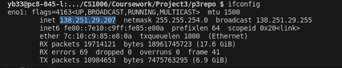

# bin folder

bin folder contains compiled code which we can use to run our programm. 
In order to compilte it, write `javac -d bin src/**/*.java` in terminal.
In order to run it, you have to write the command `java -cp bin filepath` in terminal. 

# id address

 You need to know the IP address of the machine where your server will run. You can find this by using command line tools like `ipconfig` (Windows) or `ifconfig` (Linux/Mac) and noting the IPv4 address of the network interface connected to your local network.
 
 

 On this image I highlited an IP address for a lab machine. This IP address is going to be the default one for now.

